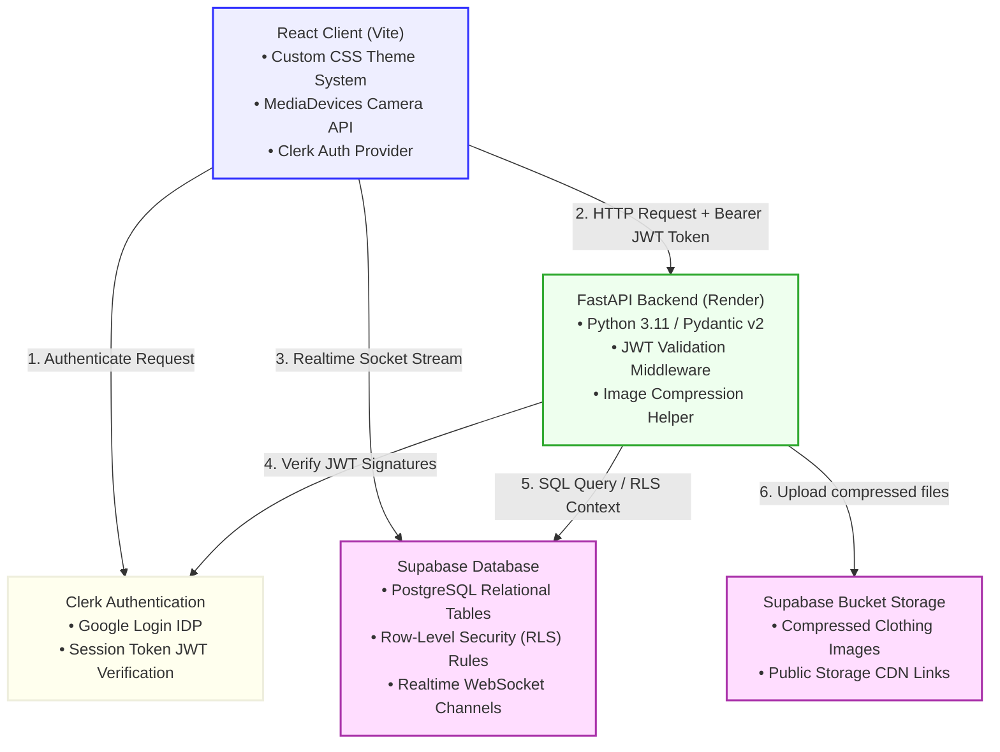
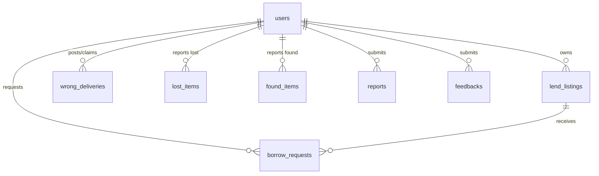

# CampusWash

<p align="center">
  
  
  
  
  
</p>

CampusWash is a secure, college-only clothes sharing, wrong-delivery coordination, and lost-and-found exchange platform built specifically for Chennai Institute of Technology (CIT Chennai) students. The platform facilitates a circular collaborative ecosystem inside the campus for lending clothes, resolving wrong laundry bag deliveries, tracking lost items, and moderating community posts.

---

## System Architecture

The following diagram illustrates the application components, hosting layers, and runtime interactions:



---

## Core Modules

| Module | Purpose | Key Functionality |
|---|---|---|
| **Borrow & Lend Board** | circular clothing sharing | List items for loan, specify max rental days, manage incoming borrow requests, track returns. |
| **Wrong Deliveries** | laundry mixup coordination | Post unrecognized laundry items directly, claim owned wrong deliveries, coordinate exchange handovers. |
| **Lost & Found** | campus items recovery | Flag lost or found items with location tagging, date timestamps, and camera image attachments. |
| **Feedback Desk** | platform improvements | Submit interactive 1-5 star ratings and suggestions directly from any page header. |
| **Moderation Center** | content governance | Report flagged posts, manage student vs. admin roles, auto-escalate reported listings. |

---

## Media & Hardware Integrations

> [!IMPORTANT]
> **Native Camera Capture API**
> CampusWash bypasses standard HTML upload hints. It integrates a dedicated **CameraCapture** element powered by the **MediaDevices API (`navigator.mediaDevices.getUserMedia`)**.
> - **Mobile devices:** Direct native camera activation (bypassing library dialogs) with rear-facing camera optimization.
> - **Desktop/Laptop:** Native webcam interface fallback with front/rear camera toggle.
> - **Fallbacks:** Independent "Upload File" control for selecting files from system folders.

---

## Database Entity Relationships

The schema is built on Supabase (PostgreSQL) with integrated Row-Level Security (RLS) ensuring strict tenant isolation:



---

## Interactive Configuration & Setup Guide

Click on any section header below to expand the configuration details, database setup instructions, and execution commands.

<details>
<summary><b>1. Environment Configuration</b></summary>

### Backend Configuration (`backend/.env`)
```ini
SUPABASE_URL=your-supabase-project-url
SUPABASE_SERVICE_KEY=your-supabase-service-role-key
JWT_SECRET=your-jwt-auth-secret
CLERK_SECRET_KEY=your-clerk-secret-key
CLERK_PEM_PUBLIC_KEY=your-clerk-pem-public-key
FRONTEND_URL=http://localhost:5173
```

### Frontend Configuration (`frontend/.env`)
```ini
VITE_API_BASE_URL=http://localhost:8000/api/v1
VITE_SUPABASE_URL=your-supabase-project-url
VITE_SUPABASE_ANON_KEY=your-supabase-anon-key
VITE_CLERK_PUBLISHABLE_KEY=your-clerk-publishable-key
```
</details>

<details>
<summary><b>2. Database Setup (Supabase SQL)</b></summary>

Execute the following SQL in your Supabase SQL Editor to initialize the database tables, indices, and Row-Level Security (RLS) policies:

```sql
create extension if not exists "uuid-ossp";

-- USERS Table
create table users (
  id               uuid primary key default uuid_generate_v4(),
  firebase_uid     text unique not null, -- Stores Clerk User ID
  email            text unique not null,
  name             text,
  register_number  text unique,
  department       text,
  batch_year       text,
  phone            text,
  profile_complete boolean not null default false,
  role             text not null default 'student' check (role in ('student', 'moderator', 'admin')),
  created_at       timestamptz not null default now()
);
create index idx_users_firebase on users(firebase_uid);
create index idx_users_email on users(email);

-- LEND LISTINGS Table
create table lend_listings (
  id              uuid primary key default uuid_generate_v4(),
  owner_id        uuid not null references users(id) on delete cascade,
  title           text not null,
  description     text,
  item_type       text not null check (item_type in ('shirt','trouser','blazer','saree','kurta','towel','other')),
  size            text,
  color           text,
  image_url       text,
  max_borrow_days integer not null default 3,
  status          text not null default 'available' check (status in ('available','borrowed','unavailable')),
  created_at      timestamptz not null default now()
);
create index idx_lend_owner on lend_listings(owner_id);
create index idx_lend_status on lend_listings(status);

-- BORROW REQUESTS Table
create table borrow_requests (
  id           uuid primary key default uuid_generate_v4(),
  listing_id   uuid not null references lend_listings(id) on delete cascade,
  borrower_id  uuid not null references users(id) on delete cascade,
  reason       text,
  borrow_from  date not null,
  borrow_until date not null,
  status       text not null default 'pending' check (status in ('pending','approved','rejected','returned','overdue')),
  created_at   timestamptz not null default now()
);
create index idx_borrow_listing on borrow_requests(listing_id);
create index idx_borrow_borrower on borrow_requests(borrower_id);
create index idx_borrow_status on borrow_requests(status);

-- WRONG DELIVERIES Table
create table wrong_deliveries (
  id          uuid primary key default uuid_generate_v4(),
  poster_id   uuid not null references users(id) on delete cascade,
  title       text not null,
  description text not null,
  item_type   text not null check (item_type in ('shirt','trouser','towel','bedsheet','blazer','other')),
  color       text,
  any_marks   text,
  image_url   text,
  status      text not null default 'unclaimed' check (status in ('unclaimed','claimed')),
  claimed_by  uuid references users(id),
  created_at  timestamptz not null default now()
);
create index idx_wd_poster on wrong_deliveries(poster_id);
create index idx_wd_status on wrong_deliveries(status);

-- LOST ITEMS Table
create table lost_items (
  id            uuid primary key default uuid_generate_v4(),
  user_id       uuid not null references users(id) on delete cascade,
  title         text not null,
  description   text,
  item_type     text not null check (item_type in ('shirt','trouser','towel','bedsheet','blazer','other')),
  color         text,
  location_lost text,
  date_lost     date,
  image_url     text,
  status        text not null default 'open' check (status in ('open','closed')),
  created_at    timestamptz not null default now()
);
create index idx_lost_user on lost_items(user_id);
create index idx_lost_status on lost_items(status);

-- FOUND ITEMS Table
create table found_items (
  id             uuid primary key default uuid_generate_v4(),
  user_id        uuid not null references users(id) on delete cascade,
  title          text not null,
  description    text,
  item_type      text not null check (item_type in ('shirt','trouser','towel','bedsheet','blazer','other')),
  color          text,
  location_found text,
  date_found     date,
  image_url      text,
  status         text not null default 'unclaimed' check (status in ('unclaimed','claimed')),
  created_at     timestamptz not null default now()
);
create index idx_found_user on found_items(user_id);
create index idx_found_status on found_items(status);

-- REPORTS Table
create table reports (
  id          uuid primary key default uuid_generate_v4(),
  reporter_id uuid not null references users(id) on delete cascade,
  target_type text not null check (target_type in ('lost_item','found_item','lend_listing','wrong_delivery','user')),
  target_id   uuid not null,
  reason      text not null,
  status      text not null default 'pending' check (status in ('pending','resolved','dismissed')),
  resolved_by uuid references users(id),
  created_at  timestamptz not null default now()
);
create index idx_reports_status on reports(status);

-- FEEDBACKS Table
create table feedbacks (
  id          uuid primary key default uuid_generate_v4(),
  user_id     uuid not null references users(id) on delete cascade,
  message     text not null,
  rating      integer check (rating >= 1 and rating <= 5),
  created_at  timestamptz not null default now()
);
create index idx_feedbacks_user on feedbacks(user_id);

-- Enable RLS for Security
alter table users             enable row level security;
alter table lend_listings     enable row level security;
alter table borrow_requests   enable row level security;
alter table wrong_deliveries  enable row level security;
alter table lost_items        enable row level security;
alter table found_items       enable row level security;
alter table reports           enable row level security;
alter table feedbacks         enable row level security;

-- PUBLIC READ POLICIES
create policy "public read lend listings" on lend_listings for select using (true);
create policy "public read wrong deliveries" on wrong_deliveries for select using (true);
create policy "public read lost items" on lost_items for select using (true);
create policy "public read found items" on found_items for select using (true);
create policy "Users can insert feedback" on feedbacks for insert with check (true);
create policy "Admins/Moderators can view feedback" on feedbacks for select using (true);
```
</details>

<details>
<summary><b>3. Local Development Setup</b></summary>

### Backend Run (FastAPI)
```bash
# Navigate to backend directory
cd backend

# Create virtual environment
python -m venv venv
source venv/bin/activate  # On Windows: .\venv\Scripts\activate

# Install requirements
pip install -r requirements.txt

# Run server
uvicorn main:app --reload --port 8000
```

### Frontend Run (React)
```bash
# Navigate to frontend directory
cd frontend

# Install dependencies
npm install

# Run dev server
npm run dev
```
</details>

<details>
<summary><b>4. Production Deployment</b></summary>

### Render Deployment (Backend)
- Create a **Web Service** pointing to the repository.
- Build command: `pip install -r requirements.txt`
- Start command: `uvicorn main:app --host 0.0.0.0 --port $PORT`
- Configure environment variables (`SUPABASE_URL`, `SUPABASE_SERVICE_KEY`, `JWT_SECRET`, `CLERK_SECRET_KEY` or `CLERK_PEM_PUBLIC_KEY`).

### Vercel Deployment (Frontend)
- Connect the repository to Vercel.
- Configure production environment variables (`VITE_API_BASE_URL`, `VITE_SUPABASE_URL`, `VITE_SUPABASE_ANON_KEY`, `VITE_CLERK_PUBLISHABLE_KEY`).
- Auto-deploys on push to `main` branch.
</details>